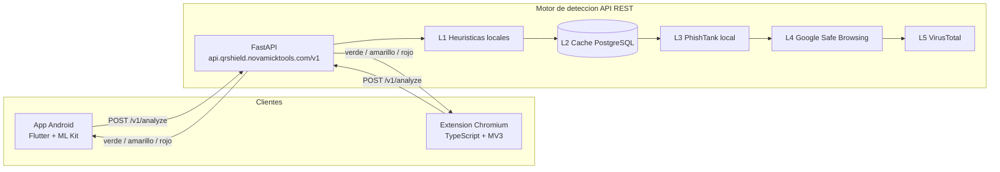
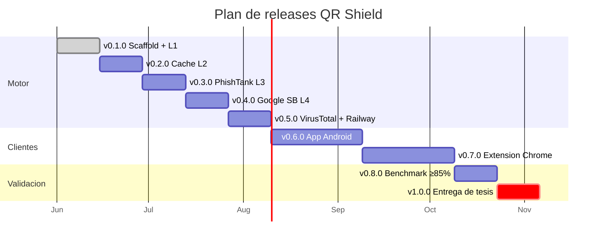

<div align="center">


<p>
  <strong>Protege a la comunidad universitaria contra ataques de <em>quishing</em>.</strong><br/>
  Extension Chromium + app Android + motor de deteccion centralizado.
</p>

<p>
  
  
  
</p>

<p>
  
  
  
  
  
  
  
</p>

</div>

---

## Tabla de contenidos

- [Sobre el proyecto](#sobre-el-proyecto)
- [Caracteristicas](#caracteristicas)
- [Arquitectura](#arquitectura)
- [Capas de deteccion (L1 a L5)](#capas-de-deteccion-l1-a-l5)
- [Stack tecnologico](#stack-tecnologico)
- [Estructura del repositorio](#estructura-del-repositorio)
- [Inicio rapido](#inicio-rapido)
- [Roadmap](#roadmap)
- [Equipo](#equipo)
- [Licencia](#licencia)

---

## Sobre el proyecto

**QR Shield** es un detector de codigos QR maliciosos disenado para prevenir
ataques de **quishing** (phishing por QR), una de las tecnicas de ingenieria
social que mas crece. Cuando un usuario escanea un QR sospechoso desde la app
o hace click en uno desde el navegador, QR Shield analiza la URL destino y
muestra un semaforo:

<div align="center">
  
  &nbsp;
  
  &nbsp;
  
</div>

> **Contexto academico:** proyecto de titulacion en Ingenieria de Software,
> Facultad de Ciencias Matematicas y Fisicas, Universidad de Guayaquil.
> Equipo ejecutor: **NovaTools**.

### Objetivo SMART
Detectar y clasificar al menos el **85%** de URLs maliciosas del benchmark
[PhishTank](https://phishtank.org/) con un tiempo de respuesta **menor a 3 segundos**.

### Alcance

| Incluido | Fuera de alcance |
|---|---|
| Extension Chromium (Chrome, Brave, Edge) | iOS y navegadores no Chromium |
| App Android (Flutter) | Sandboxing dinamico de paginas |
| Motor REST con cascada L1-L5 | Mantenimiento post-entrega de tesis |

---

## Caracteristicas

- **Escaneo nativo de QR** en Android con ML Kit de Google.
- **Interceptacion en navegador** de codigos QR embebidos en paginas.
- **Cascada de 5 capas** que minimiza llamadas a APIs externas y respeta cuotas free tier.
- **API REST versionada** (`/v1/`) consumida por ambos frontends.
- **Cache persistente** de veredictos en PostgreSQL para evitar re-analisis.
- **Semaforo visual** rojo / amarillo / verde — accesible y entendible.

---

## Arquitectura



> **Por que motor centralizado y no SDK embebido:**
> las API keys de Google Safe Browsing y VirusTotal **no pueden vivir en el cliente**,
> centralizar permite rate-limiting, cache compartido y actualizar heuristicas
> sin republicar la extension o la APK.

---

## Capas de deteccion (L1 a L5)

El motor evalua cada URL en cascada. Cada capa puede cortar la cadena si la
evidencia es suficiente, evitando llamadas innecesarias a APIs externas.

| # | Capa | Velocidad | Costo | Que detecta |
|---|---|---|---|---|
| **L1** | Heuristicas locales | Instantanea | Gratis | Shorteners, IP literales, TLDs sospechosos, URLs >100 chars, punycode |
| **L2** | Cache PostgreSQL | <50 ms | Gratis | Veredictos previos con TTL configurable |
| **L3** | PhishTank local | <100 ms | Gratis | Dataset oficial de phishing (refresh cada 12h) |
| **L4** | Google Safe Browsing | ~300 ms | 10k req/dia free | Malware, phishing, software no deseado |
| **L5** | VirusTotal | ~800 ms | 4 req/min free | Veredicto consolidado de 70+ motores antivirus |

> **SLA:** si una capa supera 1.5s, el motor devuelve veredicto parcial con
> las capas que respondieron. Mejor un amarillo a tiempo que un rojo tarde.

---

## Stack tecnologico

<table>
  <tr>
    <td align="center" width="120">
      
    </td>
    <td>Python 3.11 · FastAPI · Uvicorn · Pydantic · PostgreSQL · pytest · ruff</td>
  </tr>
  <tr>
    <td align="center">
      
    </td>
    <td>Flutter (Android) · Google ML Kit (QR scanner) · Dio · Riverpod</td>
  </tr>
  <tr>
    <td align="center">
      
    </td>
    <td>TypeScript · Manifest V3 · Vite · jsQR</td>
  </tr>
  <tr>
    <td align="center">
      
    </td>
    <td>Railway (deploy) · GitHub Actions (CI/CD) · Let's Encrypt</td>
  </tr>
</table>

---

## Estructura del repositorio

```
qr-shield/
├── motor/          # API REST del motor de deteccion (FastAPI)
├── extension/      # Extension Chromium (TypeScript + MV3)
├── app/            # App Android (Flutter)
├── shared/         # Tipos compartidos y datasets de prueba
├── infra/          # Configuracion de despliegue (Railway, GH Actions)
└── Doc/            # Documentacion academica (anteproyecto, acta, cronograma)
```

---

## Inicio rapido

### Motor (backend)

```bash
cd motor
python3 -m venv .venv
source .venv/bin/activate
pip install -e ".[dev]"
uvicorn app.main:app --reload --port 8000
```

Acceder a la documentacion interactiva: <http://localhost:8000/docs>

### Probar el endpoint

```bash
curl -X POST http://localhost:8000/v1/analyze \
  -H "Content-Type: application/json" \
  -d '{"url": "https://ejemplo.com"}'
```

> La app Flutter y la extension Chromium llegan en releases posteriores
> del [roadmap](#roadmap).

---

## Roadmap



| Hito | Estado |
|---|---|
| `v0.1.0` Motor + heuristicas L1 | En curso |
| `v0.2.0` Cache PostgreSQL (L2) | Planeado |
| `v0.3.0` PhishTank local (L3) | Planeado |
| `v0.4.0` Google Safe Browsing (L4) | Planeado |
| `v0.5.0` VirusTotal (L5) + deploy Railway | Planeado |
| `v0.6.0` App Android (Flutter) | Planeado |
| `v0.7.0` Extension Chromium (MV3) | Planeado |
| `v0.8.0` Pipeline de benchmark ≥85% | Planeado |
| `v1.0.0` Entrega final de tesis | Planeado |

---

## Equipo

| Rol | Persona |
|---|---|
| Gerente de proyecto / Scrum Master / Developer | **Moran Vera Mickaell Adrian** |
| Product Owner / Tutora academica | **Ing. Angela Yanza Montalvan** |
| Institucion | **Universidad de Guayaquil — FCMF** |

---

## Licencia

Distribuido bajo licencia **MIT**. Consultar el archivo `LICENSE` cuando se publique.

---

<div align="center">

Construido con dedicacion por <strong>NovaTools</strong> · Guayaquil, Ecuador


</div>
